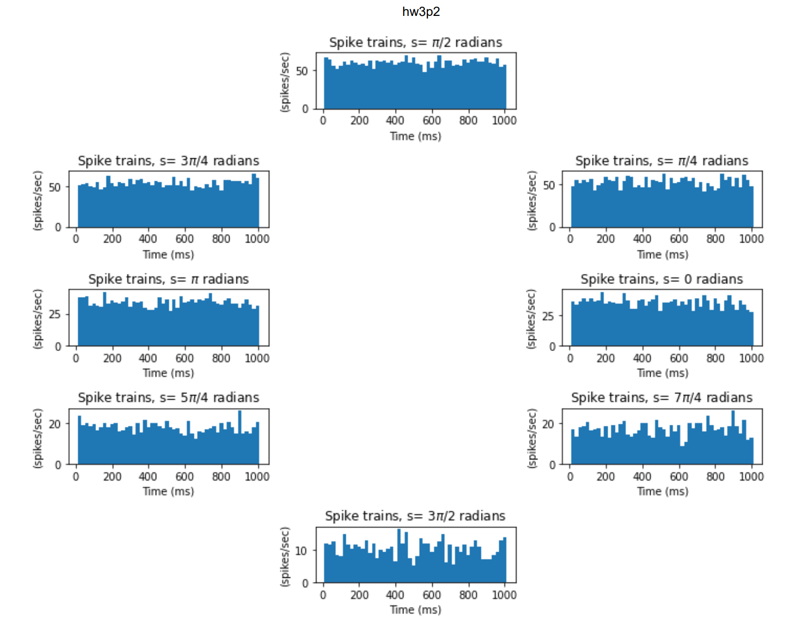
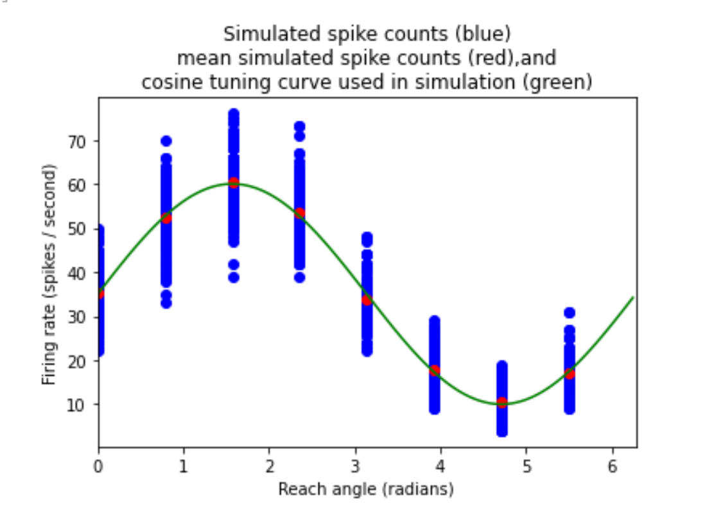
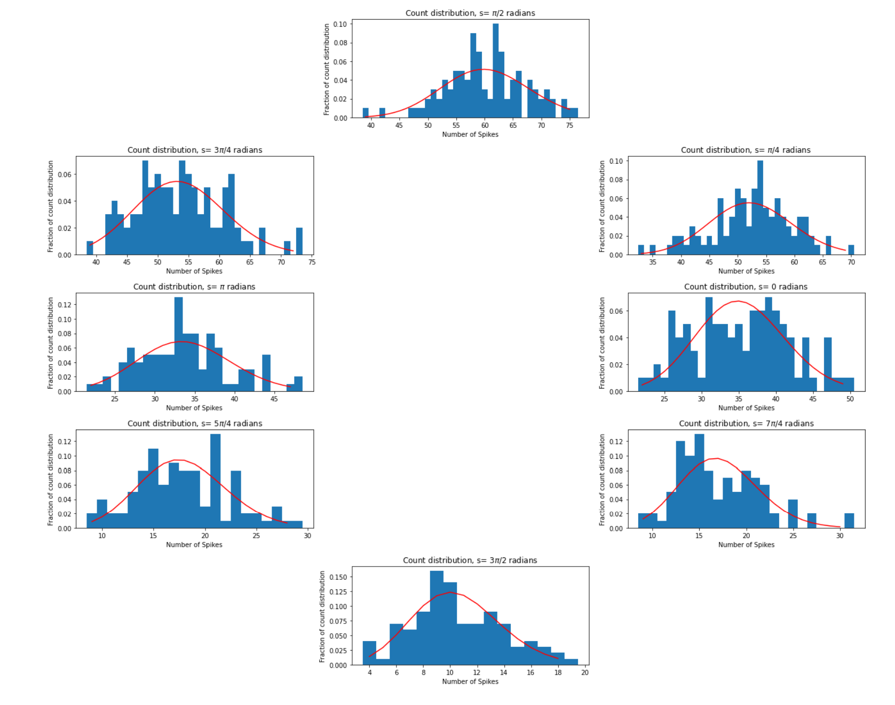
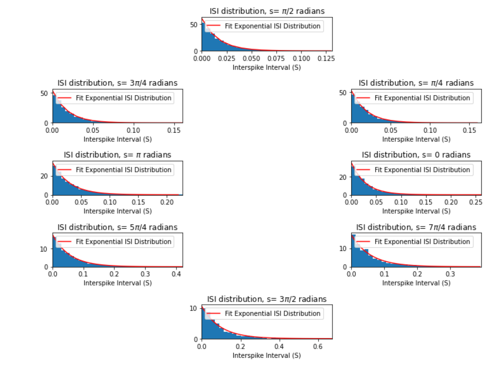
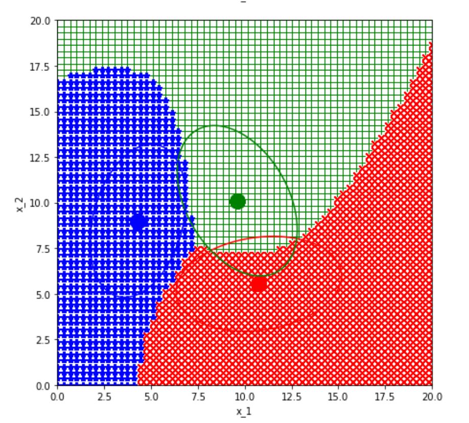
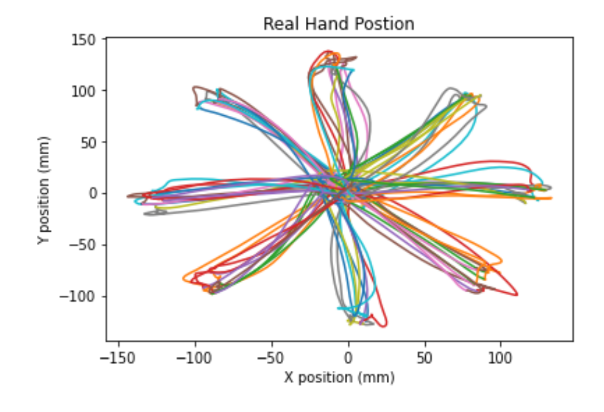
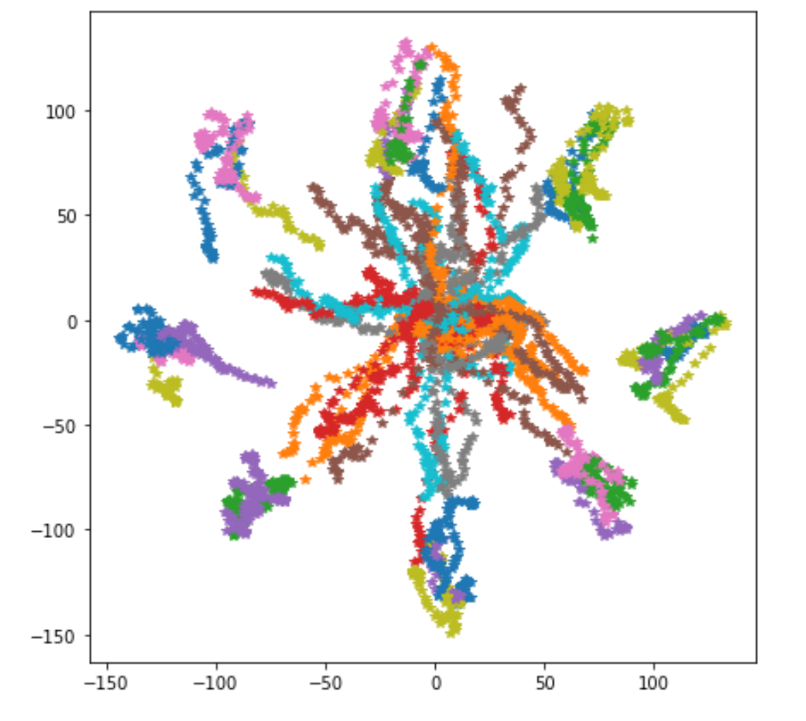

# Neural-Signal-Processing
Using Python and machine learning methods to process neural data and create predicative models.

This repo contains python soultions to NSP problems and the models I built for the class. The PDFs included are the jupyter notebooks printouts. All data that was used has been removed due to privacy concerns, but the graphs produced in the notebooks reflect the models that were built based off of these.

## Code snippet examples

Below is example image snippets I created for decoding neuron data from splitting test and implementation data sets. Algorithm models used to decode include Wiener Filter, Kallman Filter, and Optimal Linear Estimators.

